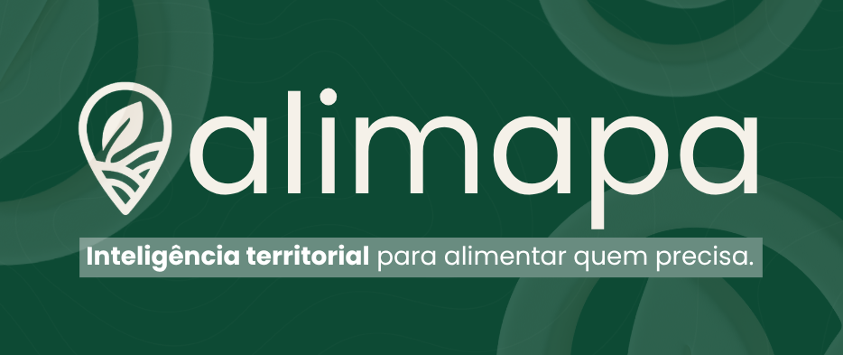

# Hackathon Devs de Impacto

# Alimapa

  

<i>Inteligência territorial para fazer o alimento chegar a quem precisa.</i>

---

&emsp;&emsp;&emsp;&emsp;&emsp;&emsp;&emsp;&emsp;&emsp;&emsp;&emsp;&emsp;&emsp;&emsp;&emsp; **[>> Accesse a documentação completa AQUI <<](https://jvwandermurem.github.io/Hackathon-Peerseed/)**

## Membros do Time

  <table>
    <tr>
      <td align="center">
        <a href="https://www.linkedin.com/in/david-deodato/">
           
          <b>David Deodato</b>
        </a>
      </td>
      <td align="center">
        <a href="https://www.linkedin.com/in/llorengarcia/">
           
          <b>Lorena Garcia</b>
        </a>
      </td>
      <td align="center">
        <a href="https://www.linkedin.com/in/davi-nascimento-de-jesus/">
           
          <b>Davi Nascimento</b>
        </a>
      </td>
      <td align="center">
        <a href="https://www.linkedin.com/in/lucas-feliciano-software/">
           
          <b>Lucas Feliciano</b>
        </a>
      </td>
    </tr>
  </table>

---

## Descrição

&emsp;O **Alimapa** é uma plataforma **B2G de orquestração da cadeia pública de abastecimento alimentar**, criada para enfrentar um dos principais gargalos da segurança alimentar no Brasil: a **falha de coordenação entre quem produz, quem demanda e quem executa a política pública**.

&emsp;Mais do que um sistema de gestão, o Alimapa atua como uma **infraestrutura inteligente de decisão**, apoiando o gestor municipal na execução de programas como **PNAE** e **PAA**. A plataforma conecta, em tempo quase real, a demanda institucional (escolas, creches, ONGs) à oferta da agricultura familiar local, garantindo eficiência logística, conformidade legal e rastreabilidade.

&emsp;No centro da solução está um **Agente Orquestrador**, que interpreta pedidos institucionais, cruza dados territoriais e legais, gera propostas de fornecimento e automatiza a documentação necessária - tudo sem substituir a decisão humana do gestor público.

&emsp;Para o agricultor familiar, o Alimapa reduz drasticamente a barreira burocrática e digital: a interação acontece de forma simples, ativa e guiada, eliminando a necessidade de lidar com editais complexos e processos fragmentados.

---

## Problema Resolvido

&emsp;A insegurança alimentar no Brasil **não é causada pela falta de alimentos ou de orçamento**, mas pela **desarticulação da cadeia pública de abastecimento**. Produção, demanda institucional, execução orçamentária e financiamento operam de forma isolada, gerando desperdício, ineficiência e insegurança.

O **Alimapa** resolve essa lacuna ao:

- **Centralizar a inteligência territorial** para o gestor municipal, oferecendo visão sistêmica da oferta, da demanda e dos riscos de ruptura alimentar;
- **Orquestrar ativamente a cadeia**, identificando produtores elegíveis, respeitando a priorização legal e facilitando a negociação por meio de IA;
- **Automatizar a burocracia pública**, gerando Projetos de Venda e documentos fiscais exigidos pelo PNAE/PAA;
- **Criar lastro auditável de impacto**, permitindo a emissão de Créditos de Impacto com rastreabilidade e comprovação de entrega.

> **Em síntese:** o Alimapa transforma burocracia em fluxo logístico e fragmentação em nutrição, garantindo execução orçamentária para o município e renda previsível para o agricultor familiar.

---

## Características-Chave

| **Categoria** | **Descrição** |
|---------------|---------------|
| 🤖 **Orquestração Híbrida** | Combina **regras determinísticas** (elegibilidade legal e priorização) com **IA generativa** (interpretação, explicação e negociação), garantindo que a IA nunca decida regras fiscais. |
| ⚖️ **Priorização Legal Nativa** | Implementa automaticamente a hierarquia legal do PNAE/PAA (produtor local, grupos prioritários, não-locais), assegurando conformidade jurídica desde o início. |
| 🔍 **Auditabilidade por Design** | Cada ação crítica gera um **AuditLog imutável**, permitindo responder de forma clara: “por que este produtor foi selecionado?”. |
| 📄 **Burocracia Invisível** | O agricultor apenas aceita ou recusa ofertas. O sistema gera automaticamente **Projetos de Venda** e minutas de **Notas Fiscais**, reduzindo fricção operacional. |
| 🛡️ **Soberania e Inclusão de Dados** | O produtor mantém controle sobre seus dados, com penalização mínima para perfis incompletos e incentivo ao preenchimento progressivo, evitando exclusão digital. |
| 💎 **ImpactCredit com Lastro Real** | Créditos de Impacto só são emitidos após a **confirmação de entrega** pela instituição, com prova de recebimento, garantindo credibilidade para compliance ESG. |

